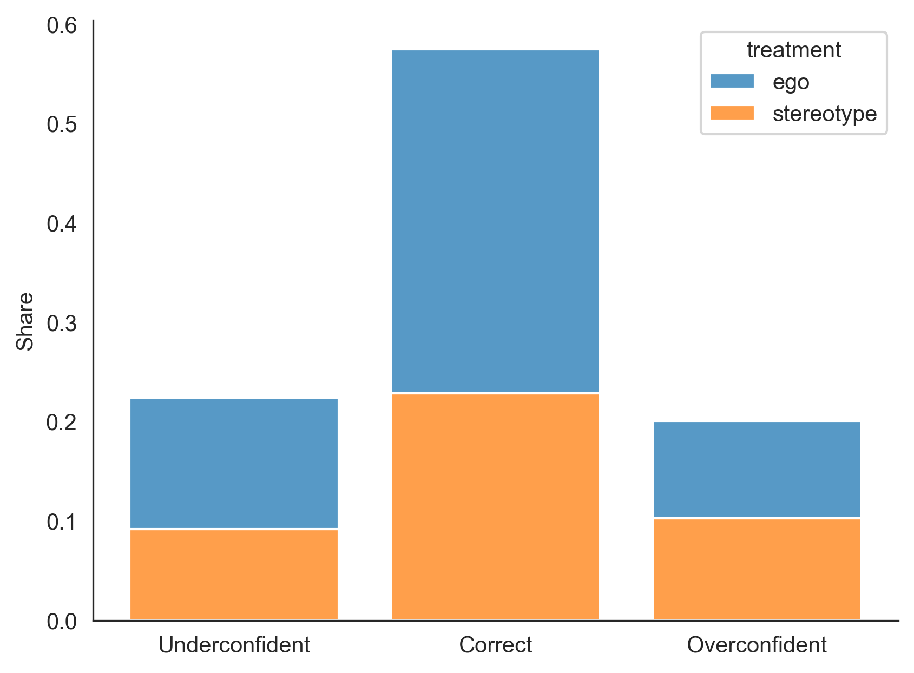
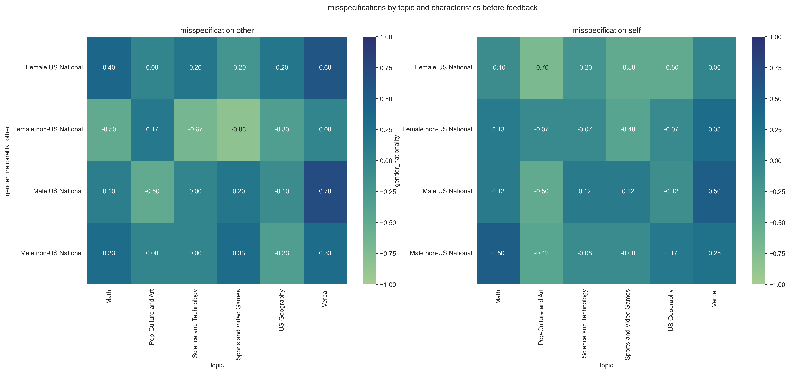
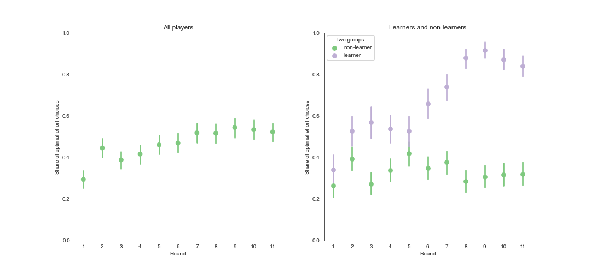
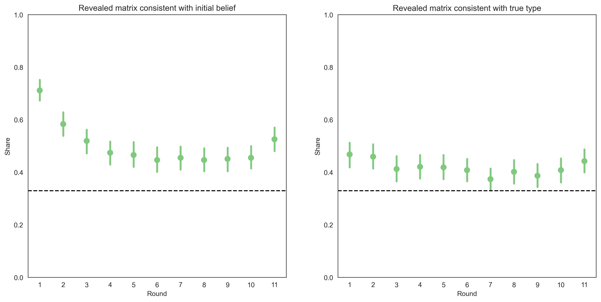
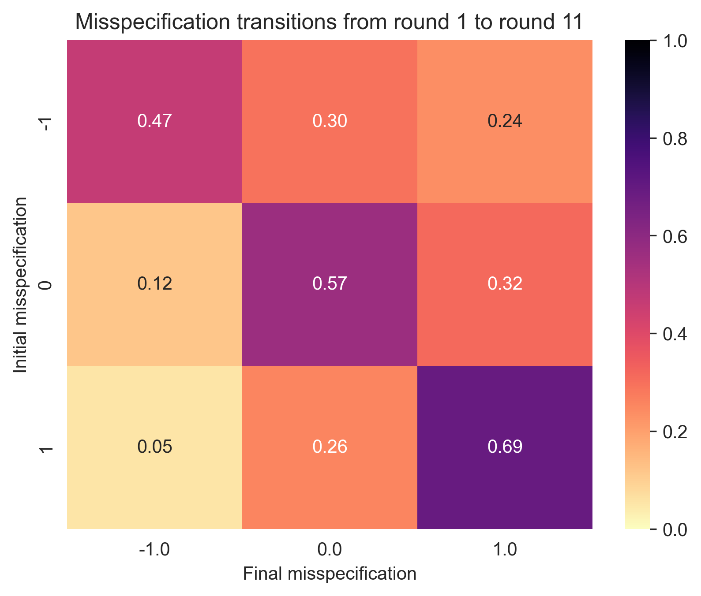
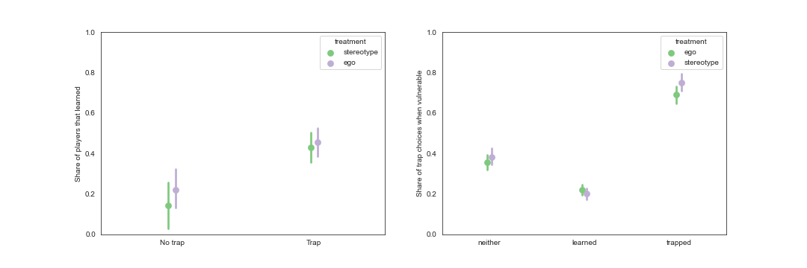
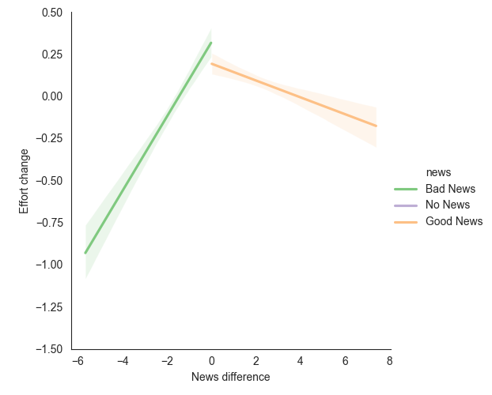
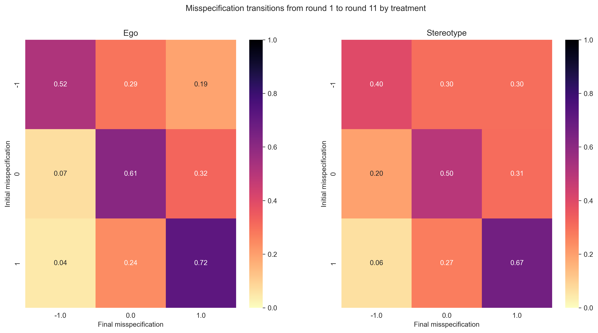

```{r dependencies, include=FALSE}
source("../Paper/parameters_and_packages.R")
```

```{r setup, include=FALSE}
knitr::opts_chunk$set(echo = FALSE, warning = FALSE, message = FALSE, fig.width = 7, fig.height = 6, fig.align = "center")
```

```{r data, include=FALSE}
updates <- fread("../Clean/updates_post.csv")
```


# Introduction

Overconfidence has been documented in a wide range of settings and has been shown to have important economic consequences:
@Camerer1999 find that overconfidence can explain the excessive entry of entrepreneurs into the market; @Hoffman2020 show that
workers who overestimate their productivity within a firm are less likely to look for a new job; @Oster2013 determine that 
people at high risk of Huntington's disease make saving decisions as if they were not at risk. 
 
Although the bias has been widely studied by economists, the settings in which 
the the belief updating procedure has been studied is narrow in scope. In particular, the literature has focused on
the cases in which the agent updates their beliefs about a single characteristic that they might care about.
For instance, @Eil2011 study the case in which the agent updates their beliefs about their own ability, and their 
own beauty in two separate experiments. Similarly, @Benoit2015 study the case in which the agent updates their 
beliefs about their own IQ.


# Theoretical Framework

I consider multiple theories of belief updating that have been proposed in the literature to rationalize
the prevalence of misspecified beliefs. I focus on two different frameworks and develop a unifying example that allows me to
compare the predictions of all the theories. In framework 1 I consider a setting in which the an agent observes
a continuous output and infers the underlying state. In framework 2, the agent observes a binary outcome and infers the
underlying probability of success. In both frameworks, I consider two nested theories of belief updating.

## Framework 1

An agent is of type $\theta \in \Theta$ and faces an unknown exogenous state $\omega$ drawn from some 
density $f$ over $\Omega$. The agent knows the 
distribution of $\omega$ but not its realized value. His belief about the state, 
$p_0(\omega)$, coincide with the true distribution, $f$; and his belief about the type is $p_0(\theta)$. 
Let the agent's true type be $\theta^{*}$,  and the realized state be $\omega^{*}$.

An agent's belief about the type is \emph{misspecified} if it assigns probability zero to their true type. Furthermore, the agent is 
\emph{dogmatic} if he holds a degenerate belief that places probability one on being of type $\hat{\theta}$. An 
agent can be dogmatic and misspecified, in which case $\hat{\theta} \neq \theta^*$ and $p_0(\hat{\theta}) = 1$.

The agent chooses an action $a\in A$ and observes a noisy outcome $h$. 
The outcome is a function of the agent's type, the state, and
the action. In particular $h = h(\theta^*, \omega^*, a) + \varepsilon$ with $h(\cdot)$ increasing in both $\theta^*$ and $\omega^*$, 
and such that conditional on a pair of parameters $(\theta, \omega)$, there is a unique optimal action. 
additionally, $\varepsilon\sim N(0, \sigma)$ is noise in the output.  
 
After observing the outcome, the agent updates his beliefs about $\theta$ and $\omega$ using some algorithm and moves on to the next period.
He repeats this process infinitely many times. I make the simplifying assumption that the agent is myopic and chooses the action 
that maximizes the payoff in each period. This assumption simplifies the analysis and plays a role in whether an agent who updates
 their beliefs using Bayes rule would learn the truth or not, however, for the main theory discussed in this section, the results hold
 even when relaxing this assumption. The behavior of a forward-looking agent is further discussed in the conclusion.


A key notion in this setting is that of a self-defeating equilibrium\footnote{This notion is an adaptation of the Berk-Nash equilibrium in 
\citet{Esponda2016} to this setting with only one agent}. 
A \emph{self-defeating equilibrium} is a belief and action pair such that the agent's belief about their type is misspecified and the 
outcome generated by the action is consistent with the misspecified belief. This means that the average outcome under the true type and the true 
state equals the average output the agent expects under the misspecified belief. The agent's belief is said to be 
\emph{stable} when this happens.

Within this framework, I consider two nested theories of belief updating: the first one is a dogmatic modeler from @Heidhues2018,
The second one is a switcher, as in @Ba2023. The dogmatic modeler can be seen as a switcher with an infinitely sticky initial belief
so the two theories are nested. However, outside of the limiting case, they produce different 
predictions about the agent's behavior. I discuss each of them separately in what follows.

### The Dogmatic Modeler

Take the action space to be the same as the state space $\Omega$ and  $\Omega =A=[\underline{a}, \infty)$. 

A dogmatic agent does not update their beliefs about $\theta$, instead, he holds a degenerate belief that places probability on 
$\hat{\theta}$, which is potentially misspecified. 
In this case, no matter
how much information he gathers against being of type $\hat{\theta}$, he will not update his beliefs about it. 
Any discrepancies between the 
observed outcomes and his believed type are incorporated using the Bayes rule to update his beliefs about $\omega$.
@Heidhues2018 show that, under certain assumptions on the per-period utility,\footnote{The assumptions are that 
$u$ is twice continuously differentiable with: (i)$u_{aa}<0$ and $u_a(\underline{a},  \theta, \omega)>0>u_a(\Bar{a}, \theta, \omega)$, 
(ii) $u_{\theta}, u_{\omega}>0$ and (iii) $u_{a\theta}<0$ and $u_{a\omega}>0$. Where $\underline{a}$ is the
minimal action and $\Bar{a}$ is the maximal one. 
 The direction of the derivatives is a normalization
and the results would hold even when the signs are reversed.} 
a dogmatic modeler will inevitably fall into a self-defeating equilibrium. The equilibrium will be such that
the outcomes they observe reinforce their belief on $\omega$ in such a way that as $t\to\infty$ the agent will 
be sure that
the state is some $\omega^{'}$ consistent with their believed type and the observed data. In other words, 
they will be in a self-defeating equilibrium with a stable belief that places probability one on the incorrect
parameters $(\hat{\theta}, \omega_{\infty})$

The mechanism by which the dogmatic agent falls into the self-defeating equilibrium is the following: Suppose the agent holds the 
misspecified belief that they are type $\hat{\theta}>\theta^*$. For any prior over $\omega$, the agent will be disappointed by the outcome.
He expected a gain of $h(\hat{\theta}, \mathbb{E}(\omega), a)$ but instead observes  $h(\hat{\theta}, \omega^*, a)$. 
There are two 
possible sources for the disappointment: the first is that the realized state is lower than the expected state; the second source is that the
agent is of type $\theta^*$ and therefore, for all possible states, his gain will be lower than what he expected. Because the agent is dogmatic,
he will not update his beliefs about $\theta$ and as a consequence will attribute the disappointment to the state being lower than expected.
He will continue to update in this way until he converges to a belief about $\omega$ that is stable. Such a belief will 
explain the observed utility perfectly and allow the agent to rationalize his dogmatic belief about $\theta$. 
Under the assumptions of @Heidhues2018, there is a unique value of $\omega$ at which the belief is stable, I will refer to such value
as $\omega_\infty$.
This mechanism is illustrated in Example 1.

**Example 1: ** 
_Set $A = \Omega=[\underline{a}, \infty)$ and consider a student with intrinsic ability $\theta^*\geq 0$ who faces a grading procedure 
$\omega^*$ that is unknown to them. 
The student knows that a higher $\omega^*$ is more likely to yield a higher grade. In particular, she knows the grade is given by 
$(\theta^*+a)\omega^*$._

_The student must choose an effort level $a$, which determines her grade. For whatever the chosen effort level, 
the student must pay a cost $c(a) = \frac{1}{2}a^2$ and receives a grade of $(\theta^*+a)\omega^*$. She repeats 
this process for infinitely many periods. 
Assume also that the student's prior is such that $\mathbb{E}[\omega]= \omega^*$ and she is dogmatic 
about being of 
type $\hat{\theta}>\theta^*$.\footnote{The example is illustrated for an overconfident student but 
the results are symmetric for a dogmatic student who initially 
places probability one on some $\tilde{\theta}<\theta^*$.}
Therefore, the student's payoff in period $t$ is given by _

\begin{equation}
u_t(a_t; \theta^*, \omega^*) = (\theta^*+a_t)\omega^* - \frac{1}{2}a^2 + \varepsilon_t
\end{equation}

_Under this specification, the myopic optimal effort level is $a_t^* = \omega^*$. 
Because the student does not know $\omega^*$,
he will choose $a_t = \mathbb{E}_t(\omega)$ where the expectation is taken with respect to the 
student's belief at the beginning of
period $t$. If she does not revise his effort choice for $k$ periods, she will receive 
an average utility of 
$(\theta^*+a_t^*)\omega^* - \frac{1}{2}a_t^{*2}$ but he was expecting an average utility of 
$(\hat{\theta}\theta+a_t^*)\omega^* - \frac{1}{2}a_t^{*2}$. In response, she will apply Bayes 
rule to update his beliefs about
$\omega$ to get the posterior belief with 
$\mathbb{E}_{t+k}[\omega] = \frac{(\theta^{*} + \omega^{*})\omega^{*}}{\hat{\theta} + \omega^{*}}$
which is lower than the initial belief. This will cause the student to choose a lower effort at $t+k$. As a result, she will again
receive an average utility that is lower than what he expected which will cause her belief to drift further down. This process will
continue until the average utility equals her expected utility under the dogmatic belief that assigns probability 1 to $\hat{\theta}$. 
At that point, the student will have reached a self-defeating equilibrium and she will continue to choose sub-optimal effort forever. _

Although the model of a dogmatic modeler rationalizes the prevalence of overconfident (underconfident) beliefs, the
assumption that the agent has a degenerate belief and no mechanism through which he can update such 
belief is very restrictive. An
alternative approach is proposed by @Ba2023. She proposes an extension of the dogmatic agent who 
is able to swithch from one dogmatic 
belief to another. By doing so, the agent can avoid the self-defeating equilibria and end up being dogmatic and correctly specified.

### The Switcher 

An agent is a \emph{switcher} if they behave as a dogmatic, but are willing to entertain the possibility that they are of a different type.
In particular, when they start off as a misspecified dogmatic, they are willing to switch to a different dogmatic belief if the data is
convincing enough. Their prior is still degenerate and assigns probability one to a particular type, and zero to 
all other types. This means that a Bayesian update on $\theta$ does not change their beliefs about the type.
However, they are willing to entertain two such beliefs and have a mechanism by which they decide which belief to adopt at any period $t$.

In order to abandon their initial dogmatic belief, the agent needs to observe a sequence of outcomes 
that are sufficiently unlikely
to have happened if they were of the type they initially believed. In order to evaluate if the evidence is convincing enough, 
they keep track of the likelihood that each of the
possible types generated the data. If the likelihood ratio is sufficiently large, the agent will switch to the alternative
and behave as if they are dogmatic about the new type.

In particular, for an agent that starts with a dogmatic belief that they are of type $\hat{\theta}$ but is willing to consider
the alternative explanation that they are of type $\tilde{\theta}$, the agent will switch to the alternative if:

$$\frac{p[h^t|\tilde{\theta}]}{p[h^t|\hat{\theta}]} > \alpha\geq 1$$

Where $h^t$ is the history of outcomes up to time $t$ and $\alpha$ is the switching threshold.\footnote{Notice that if $\alpha \to \infty$, the behavior of the switcher will be indistinguishable from that of the Dogmatic modeler. 
In this sense, the switcher is a generalization of the dogmatic type.} By keeping track of the 
likelihood ratio, the agent can perform a \emph{Bayesian hypothesis test} and adopt the Dogmatic belief that best fits 
the data.\footnote{In a related problem \citet{Schwarstein2021} proposes a similar updating procedure which relies on the Bayesian 
hypothesis test. However, in their model there is a sender who optimally chooses to propose a model that fits the data}


By allowing the agent to keep track of the likelihoods and switching to an alternative type, the switcher can avoid the 
self-confirming equilibria. However, if the prior belief on $omega$ is sufficiently tight around
a self-defeating equilibrium, the switcher might look identical to the dogmatic even in a case where $\alpha$ is not too large.
This happens because under the agent's prior, the likelihood ratio is unlikely to grow as fast as it is needed to escape 
the self-defeating equilibrium. In such situations, we say that the misspecified belief is persistent. 

## Framework 2

As in framework 1, the agent is of some type $\theta^* \in \Theta$ and the state is $\omega \sim F(\Omega)$. 
In this case, the agent chooses an action 
$a\in A$
and observes a binary outcome that is either a success or a failure. Denote the outcome by $o \in \{s,f\}$. The probability of 
observing a success is increasing in $\theta$ and in $\omega$. Whenever the agent observes a success, he gets a payoff $v>0$ and
whenever the outcome is a failure, the payoff is 0.  In addition, the probability of success is such that for each state, 
there is a unique optimal action that maximizes the agent's expected payoff. Therefore, the probability 
of success can be seen as a monotone transformation of the utility from Framework 1.

I focus on two nested theories that have been widely studied within this framework: Full Bayesian updating and self-serving attribution 
bias. I explain each of these classical models of belief updating in what follows


### The Bayesian

A Bayesian agent simultaneously updates their beliefs about $\theta$ and $\omega$ by using Bayes' rule. 
The posterior at period t+1 about $\theta$ after observing outcom $o$ is given by:
$$
p_{t+1}(\theta, \omega| h^t) = \frac{p[o|\theta, \omega]p_t(\theta, \omega)}{\sum_{(\theta', \omega')}p[o|\theta', \omega']p_t(\theta', \omega')}
$$

Where $p_{t}$ is the belief at the start of period $t+1$ and includes all the information gathered so far.

Bayesian agents choose the effort level that maximizes their expected flow payoff by taking expectations over
their prior beliefs about $\theta$ and $\omega$. Since agents are myopic, even though all the parameters 
could be identified with enough variation in choices, there will be instances in which the Bayesian will not
learn even with infinite amounts of data. This happens because, by being myopic, they do not internalize 
the tradeoff between flow payoff
and learning. This can result in too little experimentation to learn their true type. An alternative to this approach is given 
by @Hestermann2021 and is discussed in the concluding remarks. Regardless, this approach is useful as a 
benchamrk for the other theories discussed in this paper.

Also notice that if a fully Bayesian agent has a dogmatic prior, they will never update their beliefs 
about the parameter that they are dogmatic about. This will imply that they are prone to the same types 
of errors as the dogmatic modeler in framework 1.

### The Self-Serving Updater

A Self-Serving Bayesian is an agent who uses a biased version of Bayes rule to update their beliefs. 
They will update their beliefs 
about the state $\omega$ and his type $\theta$ simultaneously
by over-attributing successes to a high value of $\theta$ and under-estimating the role of higher $\omega$. Similarly,
he will attribute failure to a low state to a greater degree than an unbiased agent would. 
To model the self-serving attribution bias, I take the approach of @benjamin2019, where the posterior odds are given by:

$$
p_{t+1}(\theta, \omega| h^t) = \frac{p[h^t|\theta, \omega]^{c(\theta, \omega, o_t)}p_t(\theta, \omega)}{\sum_{(\theta', \omega')}p[h^t|\theta', \omega']^{c(\theta, \omega, o_t)}p_t(\theta', \omega')}
$$

with $c(\theta_H, \omega, o)<c(\theta_M, \omega, o)<c(\theta_L, \omega, o)\leq 1$
and $c(\theta, \omega_L, o)<c(\theta, \omega_M, o)<c(\theta, \omega_H, o)\leq 1$.

This formulation of the bias means that the agent will over-attribute successes to a high type and 
under-attribute them to a low type Whereas they will over-attribute failures to a low state and
under-attribute them to a high state. The bias is introduced by distorting the perceived likelihood 
that the signal was generated by either high values of $\theta$ when it is a success, or by low 
values of $\omega$ when it is a failure.  The parameter $c$ determines the degree of bias and imposes
enough restrictions to ensure that the model is still falsifiable.


# A Unifying Example

In order to compare the predictions of the theories discussed above, I develop a unifying example that allows me to
isolate the forces behind each of the theories. The example is a modification of the one in @Heidhues2018 and is adapted to 
implementable in the lab.

The agent can be of one of 3 types: $\theta \in \{\theta_L, \theta_M, \theta_H\}$  with $\theta_H > \theta_M > \theta_L$.
They face an unknown exogenous success rate
$\omega \in \{\omega_L, \omega_M, \omega_H\}$ with $\omega_H>\omega_M>\omega_L$. Each of the values of $\omega$ is realized with 
equal probability. 
The agent knows the distribution of $\omega$ but not its realized value.

Denote the true type by $\theta^*$ and the true state by $\omega^*$. The agent holds some prior belief about 
$\theta$\footnote{which is potentially misspecified as in the dogmatic and switcher cases discussed above} 
and chooses a binary gamble $e in \{e_L, e_M, e_H\}$. The agent observes whether the gamble is a success or a failure and 
gets a payoff of $1$ and if it is a success; they get $0$ otherwise. 

The probability of success is increasing in both $\theta$ and $\omega$ and is fully described by the Table \ref{tab:DGP}

\begin{table}[htbp]
\centering

\begin{tabular}{ c|c|c|c|}
  
  \multicolumn{1}{c}{} & \multicolumn{1}{c}{$\omega_H$} & \multicolumn{1}{c}{$\omega_M$} & \multicolumn{1}{c}{$\omega_L$}\\
  \cline{2-4}
  $e_H$ & 50 & 20 & 2 \\
  \cline{2-4}
  $e_M$ & 45 & 30 & 7 \\
  \cline{2-4}
  $e_L$ & 40 & 25 & 20 \\

  \cline{2-4}
  \multicolumn{1}{c}{} & \multicolumn{1}{c}{} & \multicolumn{1}{c}{$\theta_L$} & \multicolumn{1}{c}{}\\
\end{tabular}
\hspace{.3cm} 
\begin{tabular}{ c|c|c|c|}
  
  \multicolumn{1}{c}{} & \multicolumn{1}{c}{$\omega_H$} & \multicolumn{1}{c}{$\omega_M$} & \multicolumn{1}{c}{$\omega_L$}\\
  \cline{2-4}
  $e_H$ & 80 & 50 & 5 \\
  \cline{2-4}
  $e_M$ & 69 & 65 & 30 \\
  \cline{2-4}
  $e_L$ & 65 & 45 & 40 \\
  \cline{2-4}
  \multicolumn{1}{c}{} & \multicolumn{1}{c}{} & \multicolumn{1}{c}{$\theta_M$} & \multicolumn{1}{c}{}\\
\end{tabular}
\hspace{.3cm} 
\begin{tabular}{ c|c|c|c|}
  
  \multicolumn{1}{c}{} & \multicolumn{1}{c}{$\omega_H$} & \multicolumn{1}{c}{$\omega_M$} & \multicolumn{1}{c}{$\omega_L$}\\
  \cline{2-4}
  $e_H$ & 98 & 65 & 25 \\
  \cline{2-4}
  $e_M$ & 80 & 69 & 35 \\
  \cline{2-4}
  $e_L$ & 75 & 55 & 45 \\
  \cline{2-4}
  \multicolumn{1}{c}{} & \multicolumn{1}{c}{} & \multicolumn{1}{c}{$\theta_H$} & \multicolumn{1}{c}{}\\
\end{tabular}

\caption{Probability of success for each type, gamble and effort level}
\label{tab:DGP}
\end{table}

Conditional on a type, the agent's flow payoff is maximized by choosing the gamble that 
matches the state. For example, if the value of $\omega$ is $\omega_H$, the agent's flow payoff is maximized by 
choosing $e_H$ and if the state is $\omega_L$ the flow payoff is maximized by choosing gamble $e_L$, regardless of the value of $\theta$. 
The agent myopically chooses gambles every period to maximize the flow payoff for $T<\infty$ periods. 

After observing the outcome of each gamble, the agent updates their beliefs using some procedure and moves on to the next period.

Notice that both $\theta$ and $\omega$ can be identified from the outcomes if enough variation in the effort choices exists.
This can be seen by confirming that there is no pair of $\theta$ and $\omega$ such that the probability of success is the same for all effort 
choices. Thus, by changing the effort choice, the agent can learn both their type and the state if they observe enough outcomes.

In this example, for an agent with a dogmatic belief about their type, a self-defeating equilibrium is one in which the agent 
chooses an effort level that, under the true $\theta$, yields a frequency of success that is consistent with the agent's 
misspecified belief. That is $P[\text{sucess}|\theta^*, e^*] = P[\text{sucess}|\hat{\theta}, e^*]$ where $e^*$ is the agent's 
myopic optimal choice.

In the data-generating process described above, there are five such equilibria. For example, if the agent is of type $\theta_M$  but
mistakenly believes that he is of type $\hat{\theta}=\theta_H$ and the 
and $\omega^* = \omega_M$, when the effort chosen is $e_L$, the agent will observe a success with 45% chance. Because the agent 
dogmatically believes that their type is high, they will erroneously conclude that the rate is $\omega_L$. Under this belief,
the optimal action is $e_L$ which will continue to generate successes with $45%$ probability, further reinforcing
the incorrect belief. By doing so, the agent forgoes the payoff from gamble $e_M$ which would yield a success with $65\%$ chance.

By including self-confirming equilibria, the example captures the forces from each of the updating mechanisms discussed in the 
previous section and allows for the comparison of the main forces behind the theories. For realizations of $(\theta, \omega)$ for which there are 
self-confirming equilibria, the dogmatic agent will fall into the 
trap whereas the switcher will be able to escape it. Similarly, an agent with self-attribution bias will update their beliefs differently from an unbiased Bayesian, leading
them to choose different gambles. I exploit such cases in order to test which model is a better fit for how subjects behave in a 
laboratory experiment.\footnote{because the setting does not match that of @Heidhues2018, there will be situations for which the theory 
does not provide a prediction. If such cases arise in the lab, they will not be used for the analysis. However, whether a misspecified 
belief persists or not for the switcher, depends highly on the realized history of signals that he gets.} In what follows I explain 
the details of how this example was implemented in the lab.

# Experimental Design

I recruited `r length(unique(updates$code))` undergraduate subjects from the CESS lab at NYU who participated in an in-person experiment. 
Sessions lasted approximately 
45 minutes and subjects earned an average payment of $\$22.6$. The experiment was programmed using oTree [@otree].

The experiment consisted of 2 treatments: the \emph{ego-relevant} condition and the \emph{stereotype} condition. Subjects participated 
in only one of the treatments. All subjects within a session participated in the same treatment and the 
first 4 treatments were assigned the ego-relevant condition; the rest were assigned to the stereotype treatment. 
The tasks were identical across treatments, 
except for parameter $\theta$. In the ego-relevant condition $\theta$ is the subject's own performance in a quiz, while in the 
stereotype condition, it is the performance of a randomly selected subject from another session.

The experiment had 3 parts. In Part 1 subjects had 2 minutes to answer as many multiple-choice questions as they could from a 
20-question quiz. They did this for quizzes on 6 different topics. The topics were: Math, Verbal 
Reasoning, Pop-culture and Art, Science and Technology, US Geography, and Sports and Video Games. 
In this part, they did not know how many questions were available and they were given no feedback.

After taking all 6 quizzes, they proceeded to part 2 where they were asked to guess their score on each of them. 
In the stereotype 
treatment they were additionally asked to guess the score of a randomly drawn participant from a previous session. 
All they knew about the other participant was their gender identity and whether they were US nationals or not.
For each guess, they had three score options: Low-Score (5 or fewer correct answers), Mid-Score (between 6 and 15 correct answers), 
High-Score (16 or more). Each of the score categories corresponded to $\theta_L$, $\theta_M$, and $\theta_H$ respectively. 
They were also asked to say how confident they felt about their choices. They had 4 possible answers: "it was a random guess", 
"there is another equally likely score", "I am pretty sure", "I am completely sure". 
These 4 answers are mapped to priors that place probabilities 
.33, .50, .75, and 1 to the chosen type. The remaining probability is split equally among the other two types. 
Questions in Part 2
were not incentivized, but subjects were told that providing an accurate answer would increase their chances of earning more money in 
the last part of the experiment.

The purpose of Part 2 is to classify subjects into overconfident, underconfident and correctly specified. If a subject 
guesses their score to be in a higher (lower) category than their true score, they are overconfident (underconfident); if they 
guess their score to be in the same category as their true score, they are correctly specified. 
This classification is done for each of the 6 topics separately.

Finally, in Part 3, subjects completed a belief updating task for each of the quizzes. Before starting the task they were reminded of their guess
for the score. In the ego-relevant treatment, they were reminded of their guess about themselves and in the stereotype treatment they were reminded
of their guess about the other participant. In the stereotype treatment, they were also reminded of the characteristics of the other participant.

For one topic at a time and in random order,
they were presented with the three gambles from the example above and were asked to choose one of them. 
The probability of success was 
determined by their own score in the ego-relevant condition, and by the score of the other participant in the stereotype condition. 
Subjects had access to the three probability
tables in the printout of the instructions at all times and the meaning of each cell was explained in detail. 

In the interphase, they had to choose which of the 3 tables they wanted to see before entering their choice in it. This was done as 
an alternative to a belief elicitation in each round. I take their choice of table to be indicative of their beliefs about
the underlying type. I chose not to elicit the beliefs at each round to stay true to the forces in framework 1.

Once they have entered their choice, they observe a sample of 10 outcomes from the gamble they chose. After observing the outcomes, 
they returned to the choice screen and entered a new choice. In the choice screen 
subjects had access to the entire history of gambles and outcomes for that task as well as a summary of the outcomes so far. 
Once they entered 11 gambles (and observed 110 outcomes), they moved on to 
the next topic and repeated the same procedure. They all did this for all 6 topics. 

At the end of the experiment, one of the 6 topics was randomly selected to determine the payment. 
They earned $\$0.20$ for each 
correct answer in the quiz, and for each success in the task in Part 3 for the selected topic.

Randomness is controlled throughout the experiment and sessions by setting a seed at the beginning of the
first session. The seed was drawn at random and remained fixed for all sessions.\footnote{The seed that was drawn 
at the beginning of session 1 was 3452. The same seed was used for all sessions. It is used both for drawing $\omega$ for each of 
the tasks in the experiment, as well as for drawing the outcomes from the gambles.}
By doing this I ensure that any two subjects who have the same type and face the same exogenous rate will observe
the same outcomes. This feature allows me to identify differences across subjects in updating procedures since if they use the same 
updating procedure, they should be choosing the same gambles. 


# Predictions

In this section, I outline the behavior that is predicted by each of the theories discussed above.

## Dogmatic Modeler

Since the domain of the problem is discrete and finite in the example, the predictions of the original theory apply only to 
the combinations of parameters and initial beliefs for which there is a self-defeating equilibrium. In the example, there are 5 such 
combinations. For each of them, the dogmatic modeler predicts that the agent will fall into the self-defeating equilibrium and will 
be able to sustain the misspecified belief forever. 

Table \ref{tab:table-dog} describes the 5 self-defeating equilibria and the effort choices that sustain them. The first columns describe the
combination of parameters and initial beliefs. The last column describes the effort choice that the agent will make in the long run. It is 
only for these combinations of parameter values and beliefs that the dogmatic model makes predictions within the Unifying example. 

**Prediction 1D:** _Whenever an agent is of a type $\theta^*$ but mistakenly believes that they are of a type $\hat{\theta}$, 
and $(\theta^*, \omega^*, \hat{\theta})$ are such that there is s self-defeating equilibrium, the agent will fall into the
trap and choose the effort level that sustains the misspecified belief forever._

The model 
does not make predictions about what happens in cases where there is no stable belief. I assume that because there is 
no stable belief, the agent will eventually
have to use some procedure to revise their belief about $\theta$. In such cases, I aim to determine which of the alternative 
explanations provided by the other theories is a better fit for the data.

\begin{table}[htbp]

    \centering
    \begin{tabular}{|c|c|c|c|c|}
        \hline
        \textbf{True Type ($\theta^*$)} & \textbf{True State ($\omega^*$)} & \textbf{Believed Type ($\hat{\theta}$)} & \textbf{Believed state ($\hat{\omega}$)} & \textbf{Effort} \\
        \hline
        \hline
        $\theta_L$ & $\omega_H$ & $\theta_M$ & $\omega_L$ & $e_L$ \\
        \hline
        $\theta_M$ & $\omega_L$ & $\theta_L$ & $\omega_M$ & $e_M$ \\
        \hline
        $\theta_M$ & $\omega_M$ & $\theta_H$ & $\omega_L$ & $e_L$ \\
        \hline
        $\theta_M$ & $\omega_M$ & $\theta_L$ & $\omega_H$ & $e_H$ \\
        \hline
        $\theta_M$ & $\omega_H$ & $\theta_H$ & $\omega_M$ & $e_M$ \\
        \hline
        
        
    \end{tabular}
    \caption{Stable beliefs and the effort choices that support them for the unifying example}
    \label{tab:table-dog}
\end{table}

Although the dogmatic model does not apply to all possible parametrizations and beliefs, whether subjects
fall into the self-defeating equilibria or not is still informative of the updating procedure that they are using.
Understanding if the presence of traps is a key feature preventing subjects from learning the optimal action is important
for understanding the prevalence of overconfidence. Similarly, gaining insight into what happens 
when there are no traps is important for understanding what are the other reasons why overconfidence 
might arise and prevail.

## Switcher 

Since the switcher starts as the same dogmatic agent, the initial behavior of both types of agents is identical, 
however, because the switcher is keeping track of the likelihood ratio, they will be able to escape the self-defeating
equilibrium if the evidence is convincing enough. Therefore there is a positive probability that the switcher will
adjust their initially misspecified belief about $\theta$ and learn the true state. 

**Prediction 1S:** With positive probability, the switcher will escape the self-defeating equilibrium and learn the true state.

One caveat is that when the switcher and the dogmatic agent both start with a correctly specified belief, neither of them 
will fall into the self-defeating equilibria and thus will look identical even in the long run. This means that
in order to distinguish between the two theories, I need to look at cases where the agent starts with a misspecified belief.

The probability that the switcher will escape the self-defeating equilibrium depends on the prior belief about $\omega$.
If the prior is sufficiently tight around the self-defeating equilibrium, the likelihood ratio will not grow fast enough, however, 
in the example above, the prior is uniform over the states and therefore, the likelihood ratio is more likely to grow fast enough.

## Self-Attribution Bias

The key feature of Self-attribution bias is the asymmetric treatment of good news and bad news. 
In particular, the agent will over-attribute successes to a high type and under-attribute them to a low type.
Similarly, they will over-attribute failures to a low state and under-attribute them to a high state.
This implies that, after observing a failure, the agent will adjust their effort downwards by more than 
what an unbiased Bayesian would have done. In contrast, after observing a success, the agent will adjust 
their effort upwards by less than a Bayesian would have done and if the bias is large enough, it could
be that the agent will not adjust their effort upwards at all, or even decrease their effort in response to a success.

This is in stark contrast with what a Dogmatic modeler would do. A dogmatic modeler always attributes
any variation in the outcome to the state and never updates their beliefs about $\theta$. Therefore,
they will always increase their effort choices after a surprising success and decrease it after a failure.

On the other hand, the biased behavior can be in line with the behavior of a switcher. In particular,
if the agent starts with a misspecified belief on $\hat{\theta}$, and is willing to switch to a belief with 
$\theta'>\hat{\theta}$, whenever the paradigm shift happens, it will likely be in response to a surprising 
streak of successes. In this case, when they adjust their belief about $\theta$, they will also 
adjust their effort choice. Since they were initially underconfident, they had been choosing an effort that was
too high relative to the true state, and therefore, the effort is likely to fall in response to a 
surprising streak of success.

**Prediction 1A:** _After observing a failure, the agent will adjust their effort downwards by more than a Bayesian would have done.
After observing a success, the agent will adjust their effort upwards by less than a Bayesian would have done. If the bias is large enough,
the agent might not adjust their effort upwards at all, or even decrease their effort in response to a success._

Prediction 1A helps distinguish between the self-attribution bias and the dogmatic modeler. However, it does not help distinguish between
the self-attribution bias and the switcher. In order to do so, I need to look at cases where the agent starts with a correctly specified belief.
In these cases, the switcher is very unlikely to switch to a different belief and therefore, the behavior of the switcher will mostly change
in the same direction as the information he receives. \footnote{If they get a streak of failures they are likely to 
adjust their effort downwards and if they get a streak of successes they are likely to adjust their effort upwards.} Instead, 
the self-attribution bias will lead to a different behavior. In particular, even for agents who have a belief 
that is correctly specified and place a lot of weight on the correct values of $\theta$, the bias will 
cause these agents to become overconfident after a sequence of successes. This force is not present in the switcher or the dogmatic
and it is the key feature that allows me to identify a biased updating procedure.

**Prediction 2A:** _After observing a streak of successes, the agent will update their belief about $\theta$ upwards. This will lead to the 
possibility of observing subjects who start correctly specified and become overconfident._

## The Bayesian

The Bayesian serves as the closest benchmark to a fully rational agent. However, as discussed above, 
they are still vulnerable to falling into self-defeating equilibria, in which case, their long-run behavior
will be identical to that of the dogmatic modeler. The main distinguishing feature is that when they do 
fall into a self-defeating equilibrium, there is no bias in the direction of the misspecification that they 
end up being trapped in. In contrast, the dogmatic modeler will always be trapped in a misspecified belief
that they started with and the self-attribution updater will always become overconfident.

**Prediction 1B:** _When an agent starts with a diffused prior and falls into a self-defeating equilibrium,
they will be equally likely to fall into the underconfident trap as the overconfident trap._

**Prediction 2B:** _Bayesian agents always update their effort choices in the same direction as the information they receive. 
That is, if they see successes, they would only increase their effort; and if they see failures they would 
only decrease their effort._

# Stereotypes

So far I have focused only on the case of overconfidence about an ego-relevant parameter. 
However, each of the models can also be used to explain the prevalence
of stereotypes. An agent can have a dogmatic belief about the ability of a particular group of people and either under or overestimate
the associated parameter. Similarly, they can be willing to switch between two dogmatic beliefs about their ability as a switcher would.
Finally, they can have a biased updating procedure in which they treat good news and bad news asymmetrically.

As such, all the predictions discussed above apply to the case of Stereotypes as well. My analysis of 
stereotypes will focus only on the degree to which ego-relevance of the type affects the updating procedure and not on the 
motivations behind the bias. I am particularly interested in whether the explanatory power of the models 
differs with the degree of ego-relevance of the type.

# Results

## Initial Beliefs and misspecifications

As mentioned in the predictions section, the dogmatic modeler and the switcher are only distinguishable 
when the agent starts with a misspecified belief. Figure \ref{fig:misspecification-hist} shows the 
distribution of misspecifications by treatment. The histogram considers the difference between the subject's 
true score in the quiz and their guess about their score. If their guess is in a higher category than their true score,
they are overconfident; if it is in a lower category, they are underconfident; and if it is in the same category, 
they are correctly specified. Overall, `r round(sum(updates$misspecification != 'correct')/nrow(updates), 2)` of the 
guesses made in the questionnaire were misspecified. The rest of the guesses coincided with the true score. 
And the distribution of misspecifications is similar across treatments.

{#fig:misspecification-hist}

Although the overall distribution is similar for both treatments, the misspecifications arise for different 
combinations of characteristics in each treatment. Figure \ref{fig:misspecification-by-treatment} shows a heatmap 
of the misspecifications that arose in each treatment. In the stereotype treatment, subjects are most underconfident 
about the performance 
of other non-American females in Sports and Video Games. In contrast, they are most overconfident about the performance 
of American men in Verbal Reasoning. In the ego-relevant treatment, subjects are most underconfident about their own
performance in pop culture and art, while most overconfident about their performance in Verbal Reasoning.

{#fig:misspecification-by-treatment} 

Having widespread misspecifications in both treatments is important for the analysis because it allows me to distinguish between the
dogmatic modeler and the switcher. If there were no misspecifications, the two models would be indistinguishable.

## Learning

In this section, I analyze the learning behavior of subjects in the experiment. There are two parameters 
that subjects can be learning about: the exogenous parameter $\omega$ and the type $\theta$. 
Their belief about the exogenous parameter is tracked by their choice of effort, while their belief about the 
type is tracked by their choice of a matrix in which to enter their effort.

### Learning about the state

In order to analyze the learning about the state, I look at the share of optimal choices that are made at each round.
I find that although subjects seem to be improving in their choices overall, the last choice coincided 
with the true state only in 52% of the choices in the last round of each task. This is statistically 
greater than the initial share of optimal choices ($p<0.01$). However, it is still far from 
complete learning. It is also important to note that learning is similar across treatments. The 
share of choices that were consistent with the true state for each round is reported in panel A of 
Figure \ref{fig:learning-by-groups}.

A closer look at whether people learned or not reveals that there is a good amount of heterogeneity in the
sample. Panel B of Figure \ref{fig:learning-by-groups} shows the share of optimal choices by round for 
subjects that chose an effort that matched the state in 3 out of the last 4 rounds. It also shows the 
share of optimal choices for subjects who chose an effort that matched the state in fewer than 3 out of 
the last 4 rounds. I label the former as learners and the latter as non-learners, with learners making up
`r round(sum(updates$learned)/nrow(updates), 2)*100`% of the sample.

{#fig:learning-by-groups}

In what follows I will try to disentangle the reasons for the lack of learning. I will argue that 
it is not due to the presence of traps, but rather due to biased updating. According to the theories, 
the main reason why subjects might not learn is that they have an incorrect belief about the type or 
they develop an incorrect belief about the type.

### Learning about the type

{#fig:matrix-choices-by-round}

Since the elicitation of the belief about the type was not incentivized and not elicited in a standard way, 
I first need to confirm that subjects were not just randomly choosing a matrix in which to enter their effort.
The left panel of Figure \ref{fig:matrix-choices-by-round} shows the share of subjects who chose a matrix 
consistent with their initial reported belief. In round 1, `r round(nrow(updates[round_number == 1 & last_button_consistent == 1])/ nrow(updates[round_number==1]), 2)*100`% 
of the subjects chose a matrix that was consistent with their initial belief. This indicates that subjects
were not just randomly choosing a matrix in which to enter their effort. From round 2 onwards, the share
steadily declines, but still not as far as to indicate a random choice of matrices. This is consistent with
the subjects moving away from their starting belief through some updating procedure. 

On the right panel of Figure \ref{fig:matrix-choices-by-round} I show the share of subjects who chose a matrix
that is consistent with their true type. Unlike the left panel, there is no clear trend, which indicates that
although they are moving away from their initial belief, they are not moving towards their true type, which 
means that overall, misspecification is not decreasing. A closer look at the data reveals a good amount of
heterogeneity in the underlying behavior. 

Figure \ref{fig:transitions} shows the transition matrix for subjects who started in each of the 
3 possible starting specifications and the specifications that they ended up in at the end of the updating task.
The two things to note are that the initial belief is the most likely end belief. This is consistent with 
some degree of stickiness of the misspecifications as the switcher and dogmatic models would predict. However, 
the data also presents a lot of subjects who started with a correct belief of the type and ended up 
overestimating it. This is consistent only with the self-attribution bias. Lastly, the subjects who
initially overestimate the score, are the least likely to learn their true type.

{#fig:transitions}

The transition matrix points towards the presence of self-attribution bias in the data. However, it is
still possible that there is heterogeneity in the updating procedure across subjects. In the next section
I will look at the role of self-defeating equilibria in preventing learning. I find that the presence of
self-defeating equilibria does not seem to be the main deterrent to learning.

## Learning traps

As described above, the presence of stable misspecified beliefs act as learning traps. If an agent falls 
into one of these traps, bayesian updating will lead them to choose the same effort forever. These self-defeating 
equilibria allow me to distinguish between the dogmatic modeler and the switcher. If the agent falls into a
trap and stays there forever, they are more likely to be a dogmatic modeler. If they escape the trap, they
are more likely to be a switcher or to be updating with some attribution bias.

```{r, echo=FALSE, message=FALSE, warning=FALSE}
numerator <- length(unique(updates$player_code[updates$trap == 1 & updates$learned == 1]))

# Calculate the denominator
denominator <- length(unique(updates$player_code[updates$trap == 1]))

# Calculate the ratio
share_learned <- round(numerator / denominator, 2)

numerator <- length(unique(updates$player_code[updates$trap == 1 & updates$trapped == 1]))

# Calculate the denominator
denominator <- length(unique(updates$player_code[updates$trap == 1]))

# Calculate the ratio
share_trapped <- round(numerator / denominator, 2)
```

Overall, it does not seem to be the presence of traps that is preventing learning. Panel A of Figure \ref{fig:traps-choice}
shows that the share of subjects who learned in cases where there was a trap is larger than the share of
subjects who learned in cases where there was no trap. This is true for both treatments. This indicates
that even in the presence of traps, `r share_learned*100`% of subjects learn. From the share that 
did not learn when there was a trap. A remaining `r share_trapped*100`% can be accounted for as being 
trapped.\footnote{A subject is considered trapped when 3 out of their last 4 choices are consistent with 
a self-defeating equilibrium.} 
While the rest of the subjects neither learned nor were trapped.


A closer look at the behavior of only the cases in which there were traps reveals that among those who did not
learn, the choices that support stable beliefs were chosen much more often than among subjects who learned. 
Figure \ref{fig:traps-choice} shows the share of choices that were consistent with a stable belief for the
learners and the non-learners. The difference is statistically significant ($p<0.01$). Thus, although the 
presence of self-defeating equilibria is not the main deterrent to learning, it does seem to be a factor
in the behavior of those who do not learn. 

{#fig:traps-choice}

So far I have accounted for `r round(sum(updates$trapped)/nrow(updates), 2)*100`% subjects as being trapped, and 
`r round(sum(updates$learned)/nrow(updates), 2)*100`%
having learned the state correctly. From the remaining `r (1 - round(sum(updates$trapped)/nrow(updates), 2) - round(sum(updates$learned)/nrow(updates), 2))*100`%, 
`r round(sum(updates$categorized=='neither' & updates$trap==1)/sum(updates$categorized=='neither'), 2)*100`% were prone to traps
but did not fall into them, therefore they could not have been dogmatic modelers. Alternative explanations
are that they were switchers who considered an incorrect alternative model, or that they were updating with a bias so large that their effort
choices were far from optimal. Behavior that is not consistent with either of these falls outside of the 
scope of the theories discussed above. 

My results are consistent with the findings of @Hestermann2021. In a laboratory experiment that
stays true to Framework 1, they test the predictions of the dogmatic modeler. They find that the average
pattern in behavior is in the direction of the dogmatic modeler, however, subjects do not fully act as dogmatics as
their actions do not go as far as to fully support the self-defeating equilibrium. A lot of 
the differences between the observed behavior in their experiment and the model can be attributed 
to subjects avoiding the self-defeating equilibria and learning the true state. In contrast to their study, I can 
provide more insight into the reasons why subjects avoid the self-defeating equilibria.

## Reactions to good and bad news

One of the key features of the self-attribution bias is that the agent will react differently to good news and bad news.
In particular, they will overreact to bad news and underreact to good news. I define good news to be any sample of outcomes
for which the realized number of successes is greater than the average number of successes so far. Similarly, I define bad news to be
any sample of outcomes for which the realized number of successes is smaller than the average number of successes so far.
In addition, I calculate the difference between the realized number of successes and the average number of successes so far and
call it the news differential.
Figure \ref{fig:reaction-news} shows the correlation between change in effort and the news differential, separately for 
good and bad news. 

The overall pattern is that bad news are associated with a decrease in effort, and a 
more negative news differential is associated with a larger decrease in effort. On the contrary, good news are associated with 
a small decrease in effort. As mentioned in the predictions section, this is consistent with the self-attribution bias as well
as with a change of paradigm. It is not consistent with the dogmatic modeler or the Bayesian. Because 
I do not directly elicit beliefs, it is not possible to distinguish between the self-attribution bias and the change of 
paradigm with this data alone.
Nevertheless, the fact that about a third of the subjects started with a correctly specified belief and ended up overconfident
is consistent only with the self-attribution bias. Therefore, I conclude that the self-attribution bias is the most likely
explanation for the behavior of the subjects in the experiment.

{#fig:reaction-news}

A regression analysis of this same data reveals that indeed, the slopes are different for the two types 
of news and that the difference is statistically significant ($p<0.01$). The regression results are reported in Table \ref{tab:regression}.
columns 2 and 3 of the table consider the model for each treatment separately. I find no significant differences in 
the parameters across treatment. This is consistent with the fact that the bias is not driven by the ego-relevance 
of $\theta$.\footnote{The ego-relevance of $\theta$ is the motivation behind the self-attribution bias, 
however, the bias itself is due to an incorrect updating procedure in response to good and bad news. The presence of 
asymmetric updating in the stereotype condition can be due to self-censoring of the subjects. In particular, subjects 
who initially underestimated the performance of the other participant might have realized their mistake and 
by overestimating it after good news. This is consistent with the data presented here as well as with 
the data observed in the transition matrix for stereotypes which is reported in the Appendix} 

```{r, echo=FALSE, message=FALSE, warning=FALSE }
reg <- lm(effort_change ~ good_news + news_diff + news_diff:good_news, data=updates[round_number>1,])
robust_se <- sqrt(diag(vcovHC(reg)))

# Attach the robust standard errors to the coefficient estimates
coefs <- coef(reg)
coefs <- cbind(coefs, robust_se)
```

```{r, echo=FALSE, message=FALSE, warning=FALSE}
# run the regression only for treatment  = ego
reg_ego <- lm(effort_change ~ good_news + news_diff + news_diff:good_news, data=updates[round_number>1 & treatment == 'ego',])

# Attach the robust standard errors to the coefficient estimates
coefs_ego <- coef(reg_ego)
coefs_ego <- cbind(coefs_ego, robust_se)

# run the regression only for treatment  = stereotype
reg_stereotype <- lm(effort_change ~ good_news + news_diff + news_diff:good_news, data=updates[round_number>1 & treatment == 'stereotype',])

# Attach the robust standard errors to the coefficient estimates
coefs_stereotype <- coef(reg_stereotype)
coefs_stereotype <- cbind(coefs_stereotype, robust_se)
```

```{r, echo=FALSE, message=FALSE, warning=FALSE}

bayesian <- updates[, .(round_number, good_news_bay, signal_bay_diff, effort_change_bay)]

setnames(bayesian, c('good_news_bay', 'signal_bay_diff', 'effort_change_bay'), c('good_news', 'news_diff', 'effort_change'))

# run the regression for the bayesian simulation
reg_bayesian <- lm(effort_change ~ good_news + news_diff + news_diff:good_news, data=bayesian[round_number>1])

# Attach the robust standard errors to the coefficient estimates
coefs_bayesian <- coef(reg_bayesian)
coefs_bayesian <- cbind(coefs_bayesian, robust_se)
```

```{r, echo=FALSE, message=FALSE, warning=FALSE, results='asis'}
# report reg, reg_ego, reg_stereotype in different columns using stargazer

stargazer(reg, reg_ego, reg_stereotype, reg_bayesian,  
          title='Regression of effort change on news difference with robust standard errors', 
          dep.var.labels='Change in effort', 
          covariate.labels=c('Good news', 'News difference', 'News difference * Good news'),
          column.labels=c('All', 'Ego-relevant', 'Stereotype', 'Bayesian Simulation'), 
          omit.stat=c('f', 'ser'), 
          digits=2, 
          label='tab:regression', 
          header=FALSE, 
          se = list(coefs[, 2], coefs_ego[, 2], coefs_stereotype[, 2], coefs_bayesian[, 2]))

```

More convincing evidence against the Switching model is the lack of inverse or attenuated correlation between 
the change in effort and the news differential. In particular, if the switcher were the underlying model,
I would expect overconfident subjects who start with an overestimation of $\theta$ to increase their effort
in response to bad news that were very surprising. This would flatten the slope of the regression line 
for bad news relative to what a Bayesian would do. \ref{tab:regression} shows that the slope for bad news for
the simulation\footnote{The details on how the data was simulated are explained in the Appendix} 
of the Bayesian updates is much flatter than the slope in the data. 


## Stereotypes and ego-relevance

Throughout the experiment, there is little difference in the behavior of subjects across treatments.
Two of the main differences are that subjects in the ego-relevant treatment are more likely to become 
overconfident when they start with a correct belief. And that subjects in the stereotype treatment are
more likely to overreact to good news when they start by underestimating the performance of the other
participant.

These two differences present as consistent with the self-attribution bias. However, the pattern in the
stereotype treatment could also be due to self-censoring of the subjects. In particular, subjects who
initially underestimated the performance of the other participant might have realized their mistake and
over-compensated their mistake by overestimating it after good news. This is consistent with the data
and offers a more intuitive explanation for why this pattern arises in the stereotype treatment.

Furthermore, I find no evidence of confirmation bias which is something that has been suggested in the
literature of biased udating.\footnote{See \citet{benjamin2019} for a review of the literature in this and 
other biases.} In particular, I find no evidence that subjects who overestimate the score of the other 
participant are more likely to over-attribute successes to a high type and under-attribute them to a low type.
Symmetrically, I find no evidence that subjects who underestimate the score of the other participant are
more likely to over-attribute failures to a low type and under-attribute them to a high type. This is 
consistent with what @Mobius2022 find in their experiment in a less complex updating task.

# Structural estimation
I have discussed two models that are consistent with the data: the self-attribution bias and the switcher.
Although the data seems to point more convincingly towards the self-attribution bias, I cannot rule out
the possibility that the switcher is the underlying model. In this section, I estimate the structural
parameters of the two models and try to classify subjects into each of the models to assess how 
much of the data is explained by each of the two likely theories.

## Estimation of the switching threshold 


## Estimation of the self-attribution bias

## Model fit

# Conclusion

I  designed a setting in which I can distinguish between the forces of dogmatism, paradigm shifts, and optimal expectations.
Through a laboratory experiment, I collected data on behavior and infer beliefs from it. I find that 
the behavior of the subjects is consistent with the self-attribution bias. In particular, I find that 
subjects decrease their effort in response to bad news as well as to bad news, although the latter decrease 
is smaller. This is consistent with the self-attribution bias as well as with a change of paradigm. However,
I also observe that about a third of the subjects started with a correctly specified belief and ended up
overconfident. This is consistent only with the self-attribution bias. Therefore, I conclude that the
model that best explains the data is that of optimal expectations. 

I have small or no effects throughout on the ego-relevance of the type. Although the motivation behind the 
theories does not directly apply to the case of stereotypes, the lack of stark differences suggest that 
biases arise due to an incorrect updating procedure and not necessarily due to the self-serving motivation 
behind the bias. The lack of differences in the behavior of the subjects across treatments could also 
be due to self-censoring of the subjects. In particular, subjects might be initially reluctant to 
express their true belief about a particular group of people. In addition, as they learn and realize 
that their beliefs might be incorrect, they might overreact to signals to try to compensate for the initial 
bias. Such an updating procedure would be consistent with the self-attribution bias for the case of sterotypes.
I remain agnostic about whether that is truly the case or whether the lack of differences is due to other 
factors. 

Another bias that has been studied and suggested in the literature is the confirmation bias. In particular,
it has been suggested that subjects who are overestimate $\theta$ in their prior, will over-attribute 
successes to a high type and under-attribute them to a low type. Symmetrically, subjects who initially 
underestimate $\theta$ will over-attribute failures to a low type and under-attribute them to a high type.
I do not find evidence of such a bias in the data. This is consistent with what @Mobius2022 find in their
experiment.

I further investigate possible heterogeneity in the underlying models being used by estimating the 
structural parameters of the models.

# Appendix

## Transition matrix by treatment

Figure \ref{fig:transitions-treatment} shows the transition matrix for each of the treatments separately.
It shows that initial misspecifications are more sticky in the ego treatment and that subjects who 
underestimate the score of the other participant in the stereotype treatment are more likely to end up 
overestimating it than in the ego treatment. This may signal some sort of self-censoring or overreaction 
in the stereotype treatment.

{#fig:transitions-treatment}

## Model simulation

In order to simulate the data for each of the models and asses their fit, I simulated the path that each
type of agent would have taken given each possible realization of $(\theta, \omega)$. I fixed 
the seed of the random number generator to 3452\footnote{this is the seed that was drawn at random for the experiment} and fixed the signals that would be shown in each round
after each choice by drawing them before simulating. This way, the signals that the simulation 
uses coincide exactly with the signals that a subject would have seen in the experiment. 
I then use each of the algorithms defined by the models to simulate the path that the agent would have taken
given the signal and given an initial belief. For the dogmatic modeler and the switcher, I use each possible
dogmatic belief. For the Bayesian and the self-attribution bias, I use a uniform belief on theta.

# Experiment Instructions

You are about to participate in an experiment on decision-making. What you earn depends partly on your decisions and partly on chance. Please turn off cell phones and similar devices now. Please do not talk or in any way try to communicate with other participants.
We will start with a brief instruction period. If you have any questions during this period, raise your hand, and your question will be answered so everyone can hear.

**General Instructions**

The experiment is separated into two parts. You will be given instructions for each part when it is reached.

**Part 1:**

In part 1, you will be asked to solve a series of quizzes. In each quiz, you will answer multiple choice questions on one of 6 topics: Math, Verbal Reasoning, US Geography, Science and Technology, Pop Culture, and Sports and Video Games.

The order of the topics will be determined randomly.

You will see only one question at a time. Select an answer and then click the “Next” button to move on to the following question.

If you leave a question unanswered, it will be marked as incorrect. You will not be able to go back to that question once you click the “Next” button.

You will have 2 minutes for each quiz. Once the time runs out, your answers will be submitted automatically.

At the end of the experiment, the computer will randomly select one topic (each chosen with equal probability), and you will be paid $0.20 for each correct answer.

Your score on the quizzes will also affect how much you earn in part 2. The higher your score, the more likely you will be to make more money.

When you finish all six quizzes, there will be a short questionnaire that will not affect your payoff. Please answer all the questions as accurately as you can. You will have access to your answers from Part 1 when in Part 2, which can help you make better choices.

We will move on to Part 2 once everyone completes Part 1.
 
 **Part 2 (Ego):**

The task in this part will be repeated once for each topic from Part 1. For each task, you will make 11 choices.

In this part, you will choose one of 3 gambles and see 10 outcomes for the one you choose. Each outcome will be either a success or a failure, and the probability with which each of them is a success is determined by 3 factors:

Your score on the quiz for the corresponding topic,

A randomly chosen success rate,

Your choice of a gamble.

Your score is either Low (if it is 5 or less), Mid (if it is between 6 and 15), or High (if it is 16 or more). You will not know your actual score, but you will be reminded of the guess you made in part 1.

The success rate will be chosen randomly by the computer, and it can be Rate A, B, or C. Each is drawn with an equal chance (1⁄3 chance each), but you will not know which one was drawn. The rate is drawn once, at the beginning of the task, and stays fixed throughout.

To maximize the chance of success, you should choose the gamble that matches the underlying success rate:
- Gamble A maximizes the probability of a success when the rate is A,
- Gamble B maximizes the probability of success when the rate is B and
- Gamble C maximizes the probability of success when the rate is C.

After 11 gamble choices, the task will change to the next topic. This means that the probability of success for this new task will be determined by the following:
- The score you received on the quiz for the corresponding topic and 
- a new draw of the rate (A, B, or C)

At the end of the experiment, the computer will randomly pick one of the topics, and you will be paid $0.20 for each success. (For each topic, there will be 110 outcomes: 10 outcomes for each of the 11 choices you made).

We will now go over the details of the probability of success. They are described by the tables in the back.

Three tables describe the probabilities. Each table corresponds to one of the score levels: Low, Mid, and High.

Each of the columns within the matrix corresponds to one of the success rates. You do not know which was drawn, but the gambles' outcomes can help you determine the rate.

You will choose a Row.

In order to enter your choice of a gamble, you will first need to choose which matrix you want to see. If you choose a matrix that does not correspond to your score, the probabilities in the table will not match the probabilities with which the outcomes are successful.

The outcomes will be generated using:
- your actual score (table), which you do not know for certain,
- the gamble (row) that you chose, and
- the rate (column), which you also don’t know.


**Part 2 (stereotype):**

The task in this part will be repeated once for each topic from Part 1. For each task, you will make 11 choices.

In this part, you will choose one of 3 gambles and see 10 outcomes for the one you choose. Each outcome will be either a success or a failure, and the probability with which each of them is a success is determined by 3 factors:
- The score of another participant on the quiz for the corresponding topic,
- A randomly chosen success rate,
- Your choice of a gamble.

The other participant’s score is either Low (if it is 5 or less), Mid (if it is between 6 and 15), or High (if it is 16 or more). You will not know the score but will be reminded of your guess in part 1.

The success rate will be chosen randomly by the computer, and it can be Rate A, B, or C. Each is drawn with an equal chance (1⁄3 chance each), but you will not know which one was drawn. The rate is drawn once, at the beginning of the task, and stays fixed throughout.

To maximize the chance of success, you should choose the gamble that matches the underlying success rate:
- Gamble A maximizes the probability of a success when the rate is A,
- Gamble B maximizes the probability of success when the rate is B and
- Gamble C maximizes the probability of success when the rate is C.

After 11 gamble choices, the task will change to the next topic. This means that the probability of success for this new task will be determined by the following:
 - The score the other participant got on the quiz for the corresponding topic 
 - A new draw of the rate(A, B, or C)

At the end of the experiment, the computer will randomly pick one of the topics, and you will be paid $0.20 for each success. (For each topic, there will be 110 outcomes: 10 outcomes for each of the 11 choices you made).

We will now go over the details of the probability of success. They are described by the tables in the back.

Three tables describe the probabilities. Each table corresponds to one of the score levels: Low, Mid, and High.

Each of the columns within the matrix corresponds to one of the success rates. You do not know which one was drawn, but the gambles' outcomes can help you determine the rate.

You will choose a Row.


In order to enter your choice of a gamble, you will first need to choose which matrix you want to see. If you choose a matrix that does not correspond to the score, the probabilities in the table will not match the probabilities with which the outcomes are successful.

Once you enter a choice, the 10 outcomes will be generated using the following:
- the actual score (matrix), which you do not know for certain,
- the gamble (row) that you chose, and
- the rate (column), which you also don’t know.

_the full data generating process is printed in the rear side of the instructions and always available to the subjects the matrices are labeled with "if your/the other participant's score is" depending on the treatment_

**Screen walk-through script:**

This is the screen where you will enter your choices of gambles.
First, you must choose the matrix that you want to see. Whatever matrix you choose to see does not change the probabilities with which the gables are a success.
Then, you must choose a gamble (which corresponds to a row). The computer will draw 10 outcomes for that gamble using the probability in the chosen row and the column corresponding to the rate for this task.
On the right, you can choose to see either the total count of successes and failures for each gamble or the detailed history. That is the number of successes and failures for each of your choices.
The rate will be drawn again for the next task, corresponding to the next quiz topic. And you will repeat this process.

# References